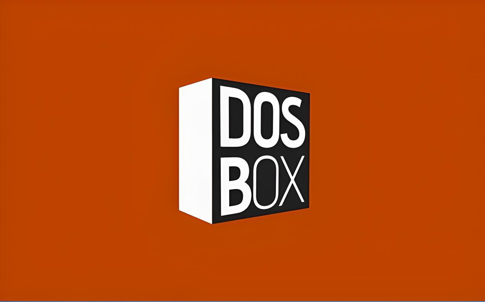
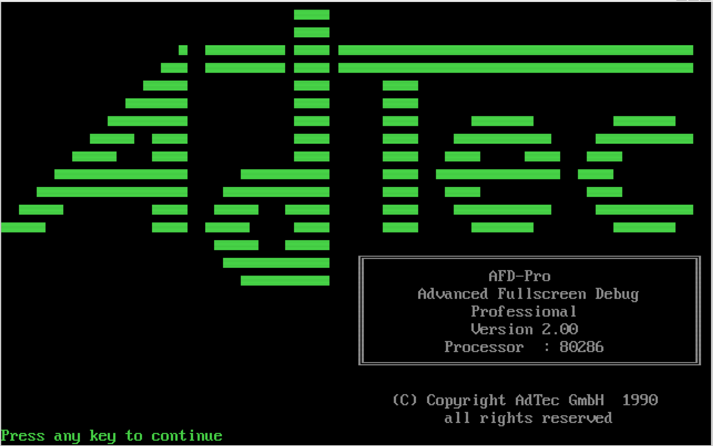
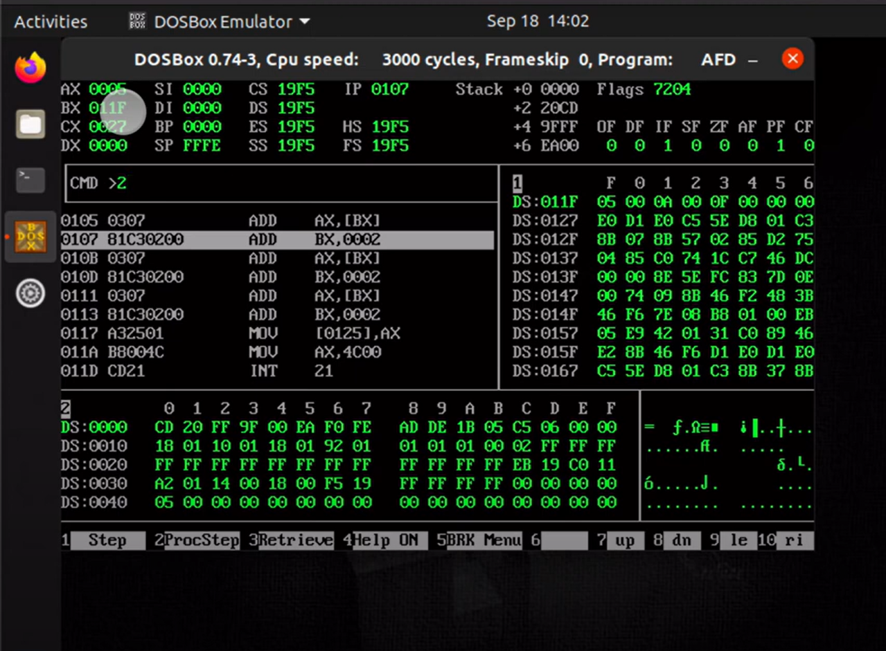

<hr />

# 4Dos Dosbox
## DOSBOX

# Steps to download and configure the Dosbox.

- ## You can download dosbox via this link. [DOSBOX](https://www.dosbox.com/ "Go to Doxbox's official website")
- ## I have installed dosbox in my WSL2 (as per my was intented).
- ## Now what I have configured in my Ubuntu(wsl) for dosbox. (main configs i modified.)
    <code>
        How to modify on wsl:
        "nano ~/.dosbox/dosbox-0.74-3.conf"
    </code>

```python
nano ~/.dosbox/dosbox-0.74-3.conf
```

```config
[sdl]
fullresolution=desktop
windowresolution=1920x1108
output=opengl
usescancodes=false

[render]
scaler=tv2x forced

[autoexec]
# Lines in this section will be run at startup.
# You can put your MOUNT lines here.
mount c /home/akshay/code/asm
c:


[autoexec]
# Add your mounts and other startup commands here

#SET PROMPT=$e[0;33m Drive: $e[0;36m $g  $e[0;35m Time: $t  $e[0;34m Path: >


SET PROMPT=$E[0;32mAkshay$E[0;35m$M $E[0;33m[$P]$E[0m$g     #[custom prompt for 4Dos beautification]*1 img.
4DOS.COM

[config]
#install=z:\mount.com c ./
#shell=c:\4dos.com @c:\4dos.ini z:\autoexec.bat
```
|  |
|:--------------------------:|
| *[caption]: 1 img.*      |

# 4DOS
 
- You can download 4dos from here : [4DOS v8](4dos800.zip)

# Now come to `4DOS` customization. (4dos.ini)
## Here's the `.ini` files provided by 4dos guide. 
- [4Dos.inf](4dosinf.zip)
- [4Dos.ini](4dosini.zip)
- [jpref50.zip](jpref50.zip) #guide pdf

### now my actual `4dos.ini file` is: [4DOS.INI](4DOS.INI) #under development
<hr />

# AFD

# The ultimate goal was to run `AFD` (asm debugger) to learn `asm lang`
- and if you want to download latest nasm link here: [nasm.zip](nasm-2.16.03-dos.zip)
## Here is the link to ***download afd***: [AssmSoft.zip](AssmSoft.zip)

# The file by GURU RECLUZE for `learning asm` is : [assembly-lang-course-master.zip](assembly-lang-course-master.zip)


# `WISH👍 YOU BEST✌️ OF FOR` 🕶️***ASM*** `LEARNING✨ JOURNEY.💻 `
